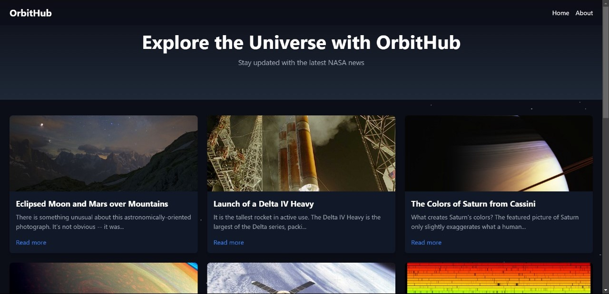

# OrbitHub
The **OrbitHub** is a web application that fetches and displays the latest news and updates from NASA's Astronomy Picture of the Day (APOD) API. This application is designed to be highly engaging and user-friendly, offering a dark-themed interface with space-inspired animations for an immersive experience.

## Description  
We are thrilled to introduce our **OrbitHub Generator**, a cutting-edge web application that combines functionality with aesthetic appeal.  

🌌 **What makes it special?**  
- **Beautiful & Interactive UI:** The application boasts a visually stunning interface designed to captivate users with its modern dark theme and space-inspired elements.  
- **Immersive Animations:** Powered by **Framer Motion**, the UI comes alive with seamless animations that enhance user engagement and create an unparalleled experience.  
- **Cool Features:** OrbitHub Generator dynamically fetches data from NASA’s **Astronomy Picture of the Day (APOD)** API, delivering a rich collection of awe-inspiring images and explanations about the universe.  

⚡ **Why it stands out?**  
Our focus on **design-first principles** ensures that functionality doesn’t come at the cost of beauty. The app is fast, responsive, and built to delight users of all kinds, whether they’re casual explorers or astronomy enthusiasts.  

## Team Members
1. [Abhijith B](https://github.com/abhi-jithb)
2. [Ali Aslam](https://github.com/aislam)

## Link to Product Walkthrough
[Watch the demo video here](https://drive.google.com/file/d/1lanmFxs771LmLSVJsGbIMe_QQqt9Cl3P/view?usp=drivesdk )

## Screenshots  
Here are some glimpses of **OrbitHub**:  

### Landing Page  
  

### Loading Screen with Video Animation  
  


## How it Works
1. **Fetch NASA News:** The application uses NASA's APOD API to fetch the latest astronomy-related updates, including images, titles, and explanations.
2. **Responsive Design:** It adapts seamlessly to different screen sizes, ensuring a smooth experience across devices.
3. **Space-Themed Animations:** Powered by Framer Motion, the app offers engaging space-themed animations.
4. **User Experience:** A clean, dark-themed UI enhances readability and provides a modern, sleek look.

## Libraries Used
- **React** - 18.x
- **Tailwind CSS** - 3.x
- **Framer Motion** - 7.x

## How to Configure
1. Clone the repository:
   ```bash
   https://github.com/abhi-jithb/Saturday-Hack-Night1.git
   ```

2. Navigate to the project folder:
   ```bash
   cd orbithub
   ```

3. Install dependencies:
   ```bash
   npm install
   ```

4. Create a .env file in the project root and add your NASA API key:
   ```bash
   REACT_APP_NASA_API_KEY=Your_NASA_API_Key_Here
   ```
5. How to Run
Start the development server:
   ```bash
   npm start
   ```
